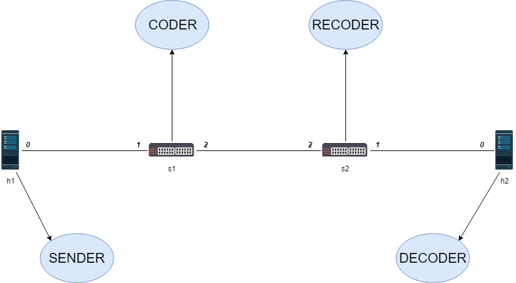

P4-RLNC Coding Switch
=====
This project consists of a network where Random Linear Network Coding is performed over the packets.

## The Topology


## Overview

The project consists in a P4 program  ```diogo_rlnc.p4``` and a couple of Python scripts.
The picture above describes the network scenario. Host ```h1``` sends the original data, the ```s1``` switch codes data and the ```s2``` switch recodes the data. Finally the ```h2```  host decodes the data.

## sender.py, receiver.py and decoder.py
There are three python scripts that make use of the Scapy package with the purpose to generate, send, receive packets and decode them.
They work as follows:

 * ```sender.py```, executes by entering the command prompt ```./sender.py  ```, the host will send three packets and will ask the user for input
 * ```receiver.py```, works by entering the command prompt ```./receiver.py "deviceName" "port"```, the device specified will sniff packets on the provided port.
 * ```decoder.py```, uses the command prompt ```./decoder.py ```, the host will receive and decode the  data.

## ffield.py, genericmatrix.py, _init_.py, rs_code.py, file_ecc.py
These four scripts are used to perform finite field arithmetics and they were used in the  ```./decoder.py``` script to decode the encoded data. 
So that the original sent data could be obtained.

These scripts are not originally from this project. The original repository, from where they come from, can be found in the following link:

  * https://github.com/emin63/pyfinite

Demo
=====
To run the project just open the terminal in the same folder of the project and type ```make```. This will launch mininet.
Now on the mininet command prompt type ```xterm h1 h2```. Two terminal windows will be launched one for each host.


On the terminal window of ```h2``` execute the ```decoder.py``` script. Next on the terminal window of ```h1``` execute the
```sender.py``` script. On executing it you will be asked to enter two elements for each three packets. Enter numbers between 0 and 255.


Meanwhile, as you enter the elements in ```h1```, the ```h2```terminal window will be showing the coded symbols and coefficients that it has received. When it finally receives all three packets. The decoding process will happen and it will show the original symbols that you first entered on ```h1```
