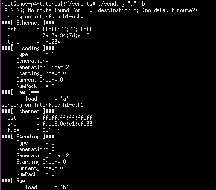

P4-XOR Coding Switch
=====
This project consists of a butterfly network with switches, controled by ONOS, capable of XOR-ing two packets together and decoding them, a basic coding technique. This is done through a P4 program which is installed on the switches of this network.

## The Butterfly Network


Overview
=
The project is composed of a P4 program, a Java app for ONOS and a couple of python scripts. 

The picture above illustrates the network scenario used in this project.
We have one host which generates and sends packets, ```h1``` , and two destination nodes, ```h2``` and ```h3```.

The switches in this network don't all have the same behaviour. We have ```s1```, ```s2``` and ```s4``` which multicasts all the packets received to the remaining ports. Switch ```s3``` performs the coding process and then forwards the packet. Meanwhile ```s5``` and ```s6``` do the decoding process and then forwards the packet to the destination hosts.

## xorcoding.p4
This coding protocol makes use of a custom header and incorporates the packet's payload in it. It is defined as following:
```
header coding_hdr_t {
    bit<8>     type; //1 if not coded, 2 if coded
    bit<8>     gen; //The number of the generation
    bit<8>     gen_size; //The size of the generation
    //These 3 fields are merely for debugging purposes
    bit<8>     starting_index;
    bit<8>     current_index;
    bit<8>     number_of_packets;
    //The payload of the packet
    payload_t  payload;
}
```

This program describes a pipeline implementing a simple coding scheme, Exclusive-OR (XOR) coding. It implements two forwarding behaviours by inserting entries in two different tables of xorcoding.p4, namely ```t_unicast``` and ```table_multicast```:

 * ```t_unicast```: this table is used to implement the forwarding to one port behaviour. It matches on the ingress port of the switch and provides the ```set_out_port``` action, which provides a single port to which the packet will be forwarded to.

 * ```table_multicast```: this table also implements a forwarding behaviour, matching on the same parameter as the above. Only in this case the ```action_multicast``` action is provided. This action provides a multicast group containing a set of ports to which the packet should be forwarded to.

Regarding the coding process itself, the p4 program can be seen as having three core modules. They are implemented by manipulating metadata and by inserting entries into three different tables ```store_table```, ```do_coding_table``` and ```do_decoding_table```. All tables match on the ingress port, except for the ```do_decoding_table``` that also matches on the type of the packet. 
The action provided by each table sets the respective metadata fields values ```store_flag```, ```do_coding```, and ```do_decoding``` to 1. This is done so that when the packet reaches the control block, the processing applied changes depending on the rules installed in the switches.   

## XorCoding.java
The XorCoding app works by registering an event listener with ONOS Device Listener. 
This listener is used to notify the XorCoding app every time a new switch is added to the network. 
Once a switch is added to the network flow rules are installed on it.
 Depending on the switch, the app will install different rules to perform forwarding, buffering, coding and decoding behaviours.

## send.py, receive.py and receiveSwitch.py
There are three python scripts that make use of the Scapy package with the purpose to generate, send and receive packets.
They work as follows:

 * ```send.py```, executes by entering the command prompt ```./send.py "payload1" "payload2" ```, the host will send two packets with the respective indicated payloads
 * ```receive.py```, works by entering the command prompt ```./receive.py```, the host will wait for any incoming packet and will show the packet when it arrives.
 * ```receiveSwitch.py```, uses the command prompt ```./receiveSwitch.py "switch" "port"```, the switch specified will sniff packets on the provided port.

Setting up
=====
To run the project you will need to download and run the following VM (in .ova format). It has the tools needed for this project.

Use the following link to download the VM:

 * http://onlab.vicci.org/onos/onos-p4-tutorial-1.14-offline.ova 
 
## Import and run the VM
The VM is in .ova format, to run it use a virtualization system such as VirtualBox. Follow the links for the instructions on how to get VirtualBox and import the VM:

 * https://www.virtualbox.org/wiki/Downloads
 * https://docs.oracle.com/cd/E26217_01/E26796/html/qs-import-vm.html

## VM Credentials
   The VM comes with one user with sudo privileges, use the following credentials to log in:
    
   * Username: ```sdn```
   * Password: ```rocks```

## Setting up the XorCoding project
We need to do a bit of set-up before we can run and test the project. First off all start by cloning the repository with the command prompt:
    
    $ git clone https://github.com/XorCoding
    
The repository contains three folders, p4-xorcoding, scripts and topos. The first one is the ONOS app, copy the folder to the ```/home/sdn/onos/apps``` directory. 
Next open the modules.bzl file, located in ```/home/sdn/onos```, and add the following lines in ONOS_APPS section:

        "//apps/p4-xorcoding/pipeconf:onos-apps-p4-xorcoding-pipeconf-oar",
        "//apps/p4-xorcoding/xorcoding:onos-apps-p4-xorcoding-xorcoding-oar",
        
As for the remaining directories in the repository, scripts and topos, you can place them wherever you want
but you will need to know their location later on, so keep that in mind. But for the sake of the example extract them to the ```/home/sdn``` directory.
Keep in mind the following paths to those folders:

     /home/sdn/scripts
     /home/sdn/topos


# Starting Onos and Mininet
Now that everything is in place we can begin by starting ONOS and Mininet.

1. Open a terminal window and start ONOS with the apps needed to run the project

    ```
    $ cd $ONOS_ROOT
    $ ONOS_APPS=proxyarp,hostprovider,lldpprovider,drivers.bmv2,p4xorcoding.pipeconf,p4xorcoding.xorcoding ok clean
    ```

    The $ONOS_ROOT environment variable points to the root ONOS directory. The ok command is an alias to run ONOS locally in your dev machine. Please note that if this the first time you run ONOS on this machine, or if you haven't built ONOS before, it can take some time (5-10 minutes depending on your Internet speed).
    
    Once ONOS has started you should see log messages being printed on the screen.
    
2. Open another terminal window and access the ONOS CLI:

    ```
    $ onos localhost
    ```
    
    In ONOS CLI command prompt you will be able to see the apps installed and activate other apps if you wish. For a list of possible commands that you can use here, type:
    
    ```
    onos> help onos
    ```

3. On a third terminal window, run Mininet to set up a butterfly topology of BMv2 devices.
    
    ```
    $ sudo -E mn --custom $BMV2_MN_PY --switch onosbmv2,loglevel=debug,pipeconf=p4-xorcoding-pipeconf, --custom /home/sdn/topos/butterfly.py --topo mytopo --controller remote,ip=127.0.0.1
    ```

Running XorCoding on the Butterfly Network
==
Now that ONOS and Mininet are running, let's move on with running a simple example to see
the capabilities of the XorCoding app.

1. On the terminal window running Mininet, enter the command prompt:
    
    ```
    xterm h1 h2 h3 s4
    ```
    Four additional windows will pop-up, one for each host in the network.
2. In the terminal window of the destinations hosts, ```h2``` and ```h3```, type:
    ```
    cd scripts
    ./receive.py
    ```
    Hosts ```h2``` and ```h3``` are now waiting for packets to arrive, ```receive.py``` is a python script that makes use of scapy for the host to sniff and show the packets received.
    
3. In the terminal window of s4, type:
     ```
     cd scripts
     ./reveiveSwitch.py "s4" "eth1"
      ```
    Switch ```s4``` will be listening for packets in port ```1```.
    
4. Now on the terminal window of the sender, ```h1```, type:
    ```
    cd scripts
    ./send.py "a" "b"
    ```
    Host ```h1``` will send two packets, one with the payload ```a``` through port ```0``` and the other with payload ```b``` through port ```1```.

If all went well, on the terminal of ```h1``` you should see the two packets being sent across the network, something like this will show up:



On the terminal window of ```s4 ```the following will show up:


Notice how the payload is different? That's because it is the result of XOR-ing ```a``` and ```b```. When ```s4``` receives a packet, it only receives one because
the two that were originally sent were already coded and sent as a single packet by ```s3```.

Finally in the destination nodes you should see the original packets obtained by the decoding process performed by ```s5``` and ```s6```.
The terminal windows of ```h2``` and ```h3``` will look like this, respectively:


And that concludes this particular simple example. By playing with the ```send.py``` script you can change some parameters,
like the generation, generation size or even send more packets at the same time.

Visualization of the exercise
==
Below you will find an animation exemplifying the exercise.


Additional Notes
==
To access the ONOS UI, use any browser to open http://localhost:8181/onos/ui. The default username and password is onos/rocks
